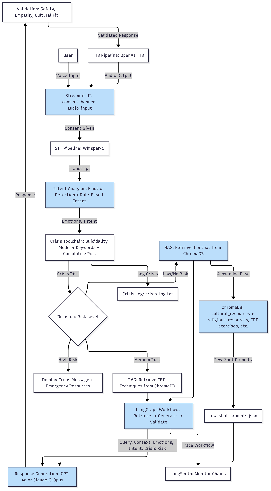

# System Architecture

The following diagram represents the **end-to-end architecture** of the OMANI Chatbot. It integrates **speech processing, crisis detection, retrieval-augmented generation (RAG), and safety validation**.

---

## Architecture Diagram

---

## Workflow Description

1. **User Interaction**  
   - The user interacts with the system via **voice input** through a Streamlit-based UI (`consent_banner`, `audio_input`).

2. **Speech-to-Text (STT) Pipeline**  
   - Audio is transcribed using **Whisper-1**, producing a transcript for downstream analysis.

3. **Intent Analysis & Emotion Detection**  
   - The transcript is processed with an **emotion detector** and **LLM-based intent classifier** to categorize user input.

4. **Crisis Toolchain**  
   - Integrates transcript, emotions, and intent to assess **cumulative crisis risk**.  
   - Decision-making is based on **risk levels**:
     - **High Risk:** Displays emergency resources immediately.  
     - **Medium Risk:** Retrieves **CBT techniques** from ChromaDB.  
     - **Low Risk:** Retrieves contextual cultural/religious support content.

5. **Retrieval-Augmented Generation (RAG)**  
   - Relevant knowledge (CBT, cultural, religious, clinical resources) is retrieved from **ChromaDB**.  
   - Combined with **few-shot prompts** (`few_shot_prompts.json`) for controlled response generation.

6. **Response Generation**  
   - Uses **GPT-4o** (primary) or **Claude-3-Opus** (failover) for empathetic and safe responses.

7. **Validation Layer**  
   - Validates responses for **safety, empathy, and cultural fit** before sending to the user.

8. **Text-to-Speech (TTS) Pipeline**  
   - Final validated responses are converted to **audio output** using OpenAI TTS.

9. **Logging & Monitoring**  
   - **Crisis Logs**: `crisis_log.txt` stores all crisis detection events.  
   - **LangSmith Monitoring**: Tracks workflows and latency for debugging and transparency.

---

## Key Components

- **ChromaDB**: Vector store for cultural, religious, and clinical knowledge.  
- **Few-Shot Prompts**: Ensures consistent style and safety in LLM outputs.  
- **LangSmith**: Observability platform for latency and workflow tracing.  
- **Streamlit UI**: Provides user-friendly access with consent handling.